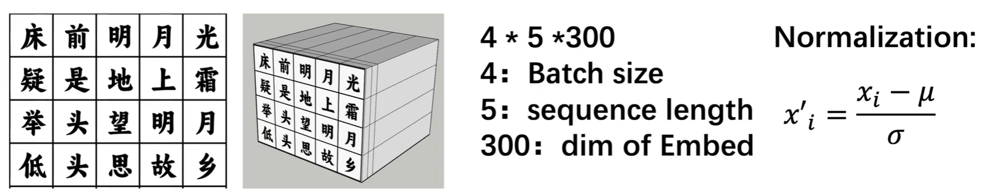
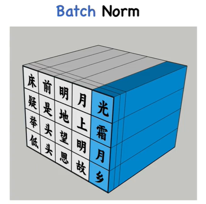
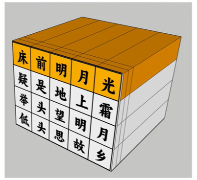

## Tokenization
使用Python的tiktoken库，编码方式为"cl100k_base"。为什么选择这个？GPT4也用的这个。对原文本进行Encoding。

text -> token
## Word Embedding
在这里，我们将有一个batch_x与batch_y，batch_y实际上只是x往右偏移了一个。这错位的一个就是要将x的预测值与y的实际值对比。也就是x是训练集，y是预测集。
```py
x_batch = torch.stack([data[idx:idx + context_length] for idx in idxs])
y_batch = torch.stack([data[idx + 1:idx + context_length + 1] for idx in idxs])
```

word embedding是文本表示的一类方法。这里选用word2vec。
对所有的token进行nn.embedding，扩展到d_model这么多维度。也就是一个单词是1 * d_model的向量。

token -> 1 * d_model vector

## Postional Embedding
和transformer一样，在这里我们用sine和cosine来生成PE。

最后对于`总的Embedding`，只需将Word Embedding与PE`直接相加`就行。

## Transformer Block
现在我们有input Embedding X。开始多头注意力机制。

### QKV
Query: 查询，要查询的信息
Key：索引，被查询的向量
Value：内容，查询得到的值

Q * K也就是查询Q与K的相似度，这个相似度就是注意力的权重alpha。将alpha与Value相乘，也就是我们需要以多大的注意力观察Value。

QKV都是从特征本身得到的，实际上都是将输入乘以Wq, Wk, Wv三个通过学习得到的矩阵得到的新的矩阵。这三个Wq的初始值都是随机的。

Q = X*Wq

K = X*Wk

V = X*Wv

为什么需要Q * K^T / sqrt(dk)，这个除以根号dk的操作是为了防止Q与K的内积过大，使梯度稳定的方法。

此时只算出来Q * K^T / sqrt(dk)这个值，并没有取Softmax。

为了实现多头注意力机制，我们要将d_model拆成多头的数量。假设我们要4个多头，也就是每个头有d_model / 4个维度。

### Mask
取矩阵下三角。对角线以及以上都是inf。此时才进行Softmax。

得到attention_score这个矩阵。


```
tensor([[[[1.0000, 0.0000, 0.0000,  ..., 0.0000, 0.0000, 0.0000],
          [0.3869, 0.6131, 0.0000,  ..., 0.0000, 0.0000, 0.0000],
          [0.2592, 0.4375, 0.3033,  ..., 0.0000, 0.0000, 0.0000],
          ...,
          [0.0614, 0.0457, 0.0789,  ..., 0.0638, 0.0000, 0.0000],
          [0.0487, 0.0595, 0.0684,  ..., 0.0396, 0.0569, 0.0000],
          [0.0282, 0.0759, 0.0825,  ..., 0.0267, 0.0471, 0.0484]],

         [[1.0000, 0.0000, 0.0000,  ..., 0.0000, 0.0000, 0.0000],
          [0.5713, 0.4287, 0.0000,  ..., 0.0000, 0.0000, 0.0000],
          [0.5335, 0.2957, 0.1708,  ..., 0.0000, 0.0000, 0.0000],
          ...,
          [0.0520, 0.0511, 0.0500,  ..., 0.0664, 0.0000, 0.0000],
          [0.0810, 0.0983, 0.0618,  ..., 0.0827, 0.0725, 0.0000],
          [0.0543, 0.0635, 0.0346,  ..., 0.0826, 0.0552, 0.0705]],

         [[1.0000, 0.0000, 0.0000,  ..., 0.0000, 0.0000, 0.0000],
          [0.4454, 0.5546, 0.0000,  ..., 0.0000, 0.0000, 0.0000],
          [0.3290, 0.2731, 0.3979,  ..., 0.0000, 0.0000, 0.0000],
          ...,
          [0.0666, 0.0811, 0.0557,  ..., 0.0475, 0.0000, 0.0000],
          [0.0658, 0.0571, 0.0824,  ..., 0.0265, 0.0571, 0.0000],
          [0.0680, 0.0428, 0.0699,  ..., 0.0552, 0.0596, 0.1035]],

         [[1.0000, 0.0000, 0.0000,  ..., 0.0000, 0.0000, 0.0000],
...
          ...,
          [0.0524, 0.0648, 0.0686,  ..., 0.0522, 0.0000, 0.0000],
          [0.0390, 0.0555, 0.0926,  ..., 0.0340, 0.0537, 0.0000],
          [0.0530, 0.0565, 0.0358,  ..., 0.0845, 0.0655, 0.0308]]]],
       grad_fn=<SoftmaxBackward0>)
```

### Calculate V Attention
最后将attention_score矩阵与V相乘。

### Concatenate
这一步将所有的Head的值都拼接起来成为一个Head，并将他们扔到一个线形层中。

拼接后得到的矩阵为 A。维度是d_model。同样的，为了得到输出output，也需要将A乘以一个系数矩阵Wo。

## Residual Connection and Layer Norm
此处进行残差连接：output = output + X

假设有一个4 * 5 * 64的矩阵。4是batch size，5是seq length，64是维度。
也就是，我们有四个1 * 5 * 64的向量。标准化的目的是为了生成一组均值为0，标准差为1的数据。

举一个省份有10000人，每个人都有5门考试成绩。

Batch Norm: 就是对所有的batch的同一个元素进行标准化。也就是对所有人的语文成绩进行标准化处理赋分，然后将其应用到别的成绩上。

Layer Norm: 对一个batch的所有元素进行标准化处理。是对一个人的所有成绩进行标准化处理。这个可以体现出一个人在各科的偏科程度。


为什么做Layer Norm?
1. 因为序列长度在变化，导致batch norm在别的位置没有值。
2. 模型复杂，如果想做minibatch让模型快速迭代，由于batch很小，做batch_norm效果比较差。
3. 计算依赖性。数据是一行一行喂给他的，batch_norm需要等到所有数据都喂进来之后才能做。而layer_norm则可以一条一条依次做。
4. 适应性和泛化能力好。batch_norm可能会把数据特征给他抹平。layer_norm则可以保持每个数据本身的特性。

## Feed Forward Network
1. 先做一次d_model -> 4 * d_model的线性层，这是为了增加input_data的维度与多样性
2. 在做一层ReLU，这是为了引入非线性，让模型学到更复杂的模式
3. 最后再做4 * d_model -> d_model的映射。

## Repeat Transformer Block to FFN


## LLM参数量计算
定义：
+ $seq\_length = L$，一个序列有多少token
+ $d_{model} = D$，词向量维度，也就是模型维度
+ $d_{head} = d$，每个头的维度
+ $n_{head} = n$，有多少个头，也就是$D // n = d$
+ $n_{vocab} = V$，词表大小，也就是所有的token的总和
+ $n_{layer} = l$，有多少层
1. Word Embedding：
   + 对于输入序列，每个词都被映射到一个D维的向量中。
   + 由于词汇表大小为V，因此词嵌入矩阵的维度是$[V, D]$
   + 总参数量为$V * D$

2. Multihead Attention:
   1. 流程
      + 输入矩阵$X$维度为$[L, D]$，其中包括L个D维向量
      + Q，K，V矩阵维度，由于要分散到每个头上，每个头的维度是d：
        + $Q = X \cdot W_Q$，$W_Q$维度为$L \cdot d$
        + 则Q的矩阵维度是$[L, d]$，同理KV
      + 注意力得分矩阵$A$为$Attention(Q, K, V) = softmax((Q \cdot K^T) / \sqrt d) \cdot V$，A的维度为$[L, L]$
      + 每个头都输出，拼接起来之后为$[L, D]$再点乘输出矩阵$W_O$，$W_O$的维度是$[D, D]$，因此最终的输出维度是$[L, D]$
    2. 参数量计算
      + 多头注意力机制的参数来源于四个矩阵$W_Q$这四个
      + $W_Q, W_K, W_V$三个矩阵维度为$[D, d]$，总共有H个头，因此参数量为$3 * D * d * H = 3 * D * D$
      + $W_O$参数量为$D * D$
      + 每个多头Block的参数量为$4 * D * D$，全部的Layer的参数量为$4 * l * D * D$，如果每个矩阵带偏置，每个再加$D$，也即是$(4 * D * D + 4 * D) * l$
3. FFN：
   1. 流程：
      + 线性层1: 将输入从$[L, D]$映射到$[L, 4D]$，带偏置的话额外加一个$4D$
      + 而后跟一个激活函数ReLU
      + 线性层2：将$[L, 4D]$映射回$[L, D]$，带偏置的话额外加一个$D$
      + 输出通过残差连接和Layer Norm送入下一层Decoder层
   2. 参数量计算：
      + 两层映射参数量之和为$4 * D * D * 2 + 5 * D = 8 * D * D + 5 * D$
      + 所有层的参数量为$(8 * D * D + 5 * D) * l$
4. Layer Norm：
   + 有两个参数，缩放Scale与偏移量Offset，每个参数的参数量都为D
   + 因此总参数量为$2 * 2 * D * l$
5. 位置编码：
   + 位置编码通常是固定的，实际上并不增加模型的参数数量
6. 全部参数总和：
   因此，全部参数总和为$12 D^2 l + 13 D l + V D$